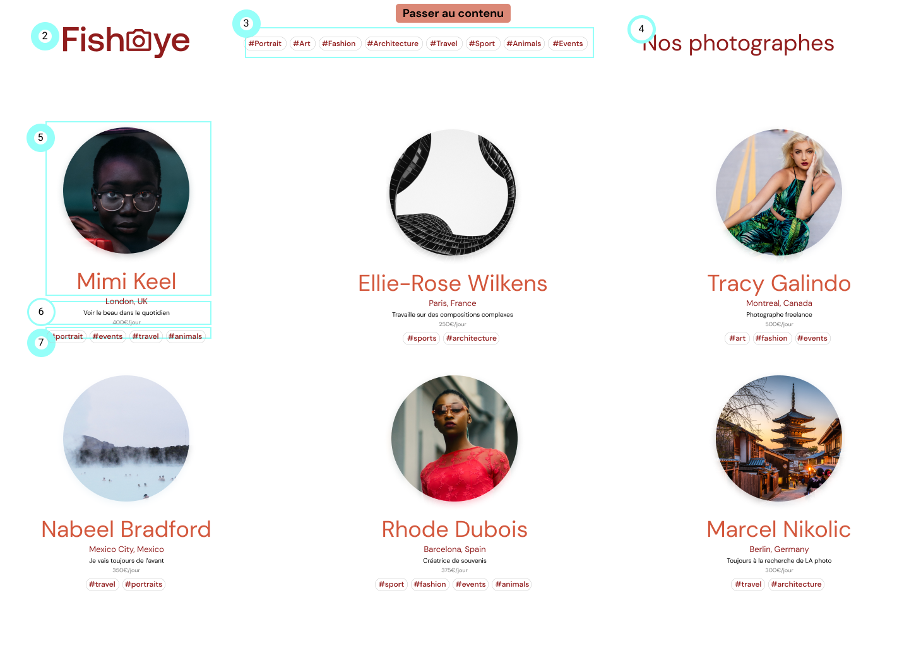

# FishEye - Site web de photographes freelances

> OpenClassrooms - "Développeur d'application - JavaScript React".  
> Créez un site accessible pour une plateforme de photographes.

## Objectifs

FishEye est un sites de photographe en freelance qui proposent leurs services. Nous proposons une plateforme unique pour présenter leurs photos et les contacter pour des événements ou des tirages.

1. Le site initialement statique doit migrer vers une version dynamique.
2. Il doit répondre à l'ensemble des standards dans le domaine de l'accessibilité.

## Livrables

### Prototype des fonctionnalités

**Page d’accueil**
- Liste de tous les photographes avec leur nom, leur slogan, leur localisation, leur prix/heure et une image miniature de leur choix.
- Lorsque l'utilisateur clique sur la vignette d'un photographe, il est amené à sa page.

**Pages des photographes (généré dynamiquement en fonction du photographe) **
- Affiche une galerie des travaux du photographe.
- Les photographes peuvent montrer à la fois des photos et des vidéos.
- Chaque média comprend un titre et un nombre de likes.
- Les médias peuvent être triés par popularité ou par titre.
- Lorsque l'utilisateur clique sur un média, celui-ci doit s’ouvrir dans une lightbox.
- Afficher un bouton pour contacter le photographe.

## Contraintes Techniques

- Suivre le principe de 'Separation of Concerns' pour les différents fichiers (HTML, CSS, JavaScript).
- Utiliser ESLint pour garantir un code robuste.
- Une version moderne (ES6 ou supérieure) de JavaScript est utilisée en faisant abstraction des fonctionnalités obsolètes.
- Le code doit intégrer de bonnes conventions de nommage (variables, fonctions...) et des commentaires explicites lorsque cela est necessaire.

## Compétences évaluées

- Intégrer l'ensemble des standards d'accessibilité pour répondre aux besoins des utilisateurs qui ont des déficiences visuelles.
- Rendre le site dynamique et utiliser des datas provenant de fichiers Json.
- Mettre en œuvre un Design Pattern Factory pour répondre aux besoins spécifiques du projet. 
- Déployer le site via GitHub Pages.

[Brief complet ici](https://course.oc-static.com/projects/Front-End+V2/P5+Javascript+%26+Accessibility/Notes+de+reunion.pdf)

